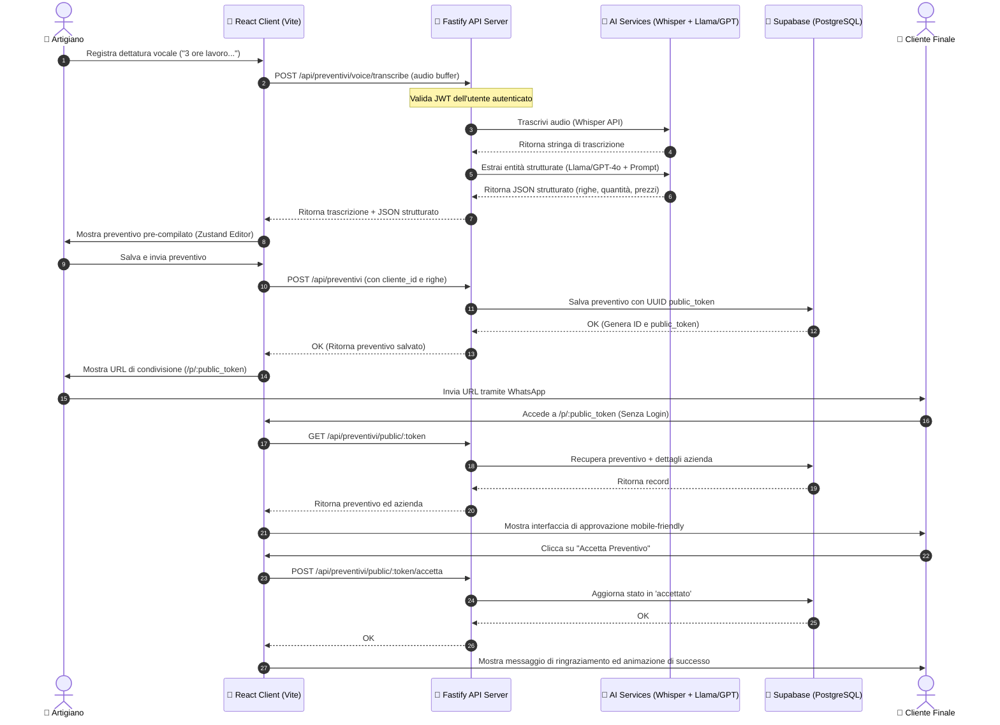
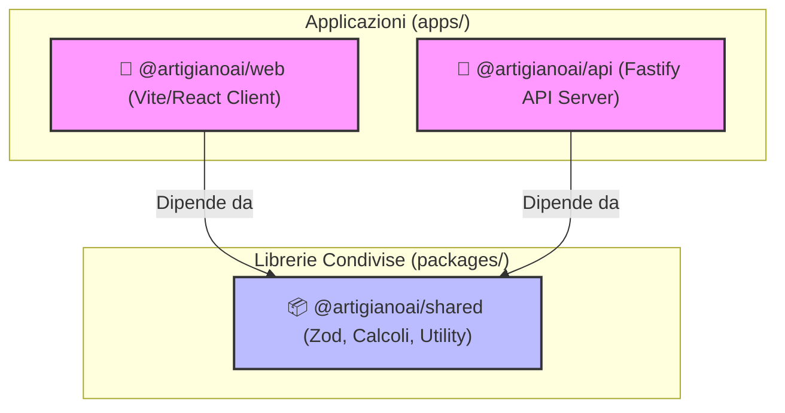
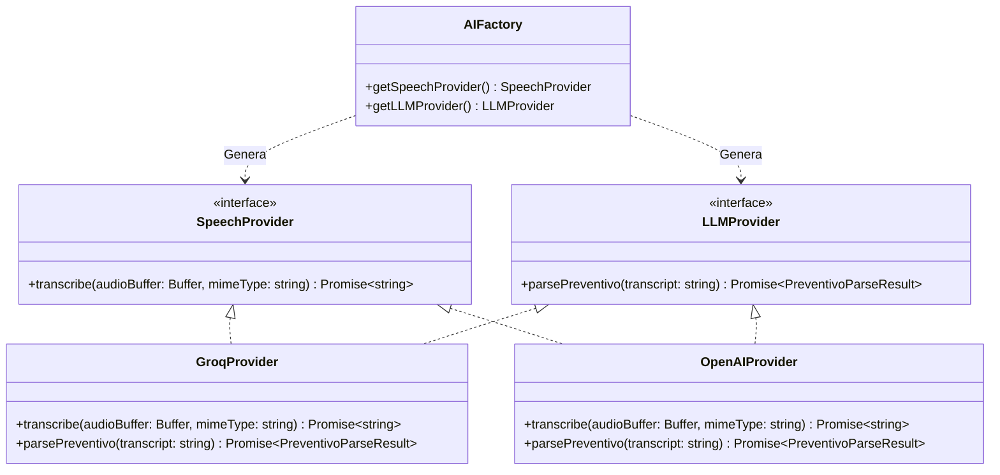
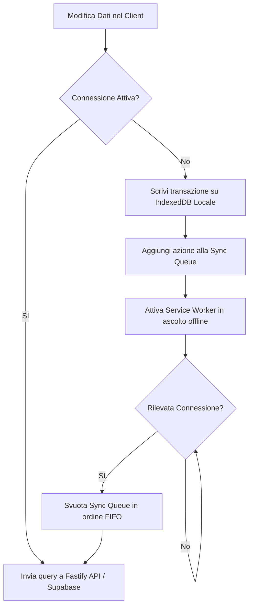

# 🏛️ Architettura di Sistema

ArtigianoAI adotta un'architettura monorepo moderna, modulare ed ottimizzata per le massime prestazioni e manutenibilità. Il sistema è suddiviso in un frontend React ad altissima reattività (Vite), un backend REST ad alte prestazioni (Fastify) che si interfaccia con i modelli di Speech-to-Text e Large Language Model (LLM), e un database PostgreSQL gestito tramite Supabase con Row Level Security (RLS) attiva per garantire l'isolamento dei dati dei singoli artigiani.

---

## 🗺️ Diagramma dei Flussi di Sistema

Il diagramma seguente illustra il ciclo di vita completo di un preventivo vocale: dalla registrazione audio effettuata dall'artigiano sul proprio smartphone, fino alla visualizzazione del preventivo strutturato e alla sua approvazione finale da parte del cliente.

---

## 📦 Struttura dei Pacchetti del Monorepo

Il diagramma di dipendenza del monorepo evidenzia la centralità del pacchetto `@artigianoai/shared`, che garantisce l'allineamento perfetto tra frontend e backend riguardo ai modelli dati e alla logica di business fondamentale.

---

## 🏢 Responsabilità dei Livelli Architetturali

### 1. Frontend: `@artigianoai/web` (React + Vite)
*   **Interfaccia Mobile-First**: Sviluppata in modalità reattiva e ottimizzata per l'uso in mobilità da parte degli artigiani direttamente in cantiere.
*   **Gestione dello Stato**: Affidata a **Zustand** per lo stato reattivo del modulo preventivi in tempo reale (`usePreventivoFormStore`) e a **TanStack Query** (React Query) per il caching globale del server, le invalidazioni e le mutazioni sincrone con Supabase.
*   **Gestione Audio**: Acquisizione hardware nativa del microfono tramite `MediaRecorder` API, compressione buffer e gestione degli stati di caricamento ed errore.

### 2. Backend: `@artigianoai/api` (Fastify + TypeScript)
*   **Prestazioni Elevate**: Basato su Fastify per garantire latenze minime e massima scalabilità.
*   **Validazione Stretta**: Integra i validatori di schema generati direttamente da `@artigianoai/shared` (tramite Zod) all'ingresso delle richieste, assicurando l'assoluta integrità dei dati prima delle query a Supabase.
*   **AI Orchestrator**: Gestisce l'invocazione sequenziale del SpeechProvider e del LLMProvider, incapsulando la gestione dei fallimenti (es. fallimento del parsing ma salvataggio della trascrizione).

### 3. Modello Dati e Caching: `@artigianoai/shared`
*   **Singolo Punto di Verità**: Contiene gli schemi Zod per utenti, clienti, preventivi e catalogo materiali.
*   **Calcoli Finanziari di Precisione**: Include le funzioni deterministiche `calculatePreventivoTotals` e `roundCurrency` per evitare differenze di centesimi dovute all'aritmetica a virgola mobile tra client e server.

---

## 🔌 Modello di Astrazione del Provider AI

L'integrazione con i servizi di Intelligenza Artificiale è governata dal design pattern **Factory**, definito in `apps/api/src/services/ai/`. Questo permette al server di essere completamente indipendente dall'infrastruttura AI sottostante:

Il comportamento del sistema è modificabile a runtime impostando la variabile d'ambiente `AI_PROVIDER` su `groq` o `openai`. Questa flessibilità permette di utilizzare modelli open-source ultra-veloci (es. Whisper Large v3 e Llama 3 via Groq) in ambiente di sviluppo a costo zero, e modelli avanzati di classe enterprise (OpenAI GPT-4o) in produzione.

---

## 📶 Strategia Offline e Gestione Sincronizzazione

### Stato Attuale (V0)
Il sistema adotta una politica di **Aggiornamenti Ottimistici** sul frontend tramite TanStack Query. Quando l'artigiano inserisce o aggiorna una riga del preventivo, l'interfaccia si aggiorna istantaneamente. Se la connessione di rete fallisce durante l'invio finale del preventivo, l'applicazione mostra un banner di errore e mantiene lo stato locale nel form store di Zustand, impedendo la perdita dei dati.

### Evoluzione Offline-First Programmata (V1)
Per consentire il pieno funzionamento all'interno di cantieri interrati o in assenza totale di copertura di rete, l'architettura V1 prevede l'introduzione di una base dati locale basata su **IndexedDB** (tramite **Dexie.js**):

1.  **Sync Queue (IndexedDB)**: Ogni operazione di scrittura (creazione cliente, salvataggio preventivo) non andata a buon fine viene inserita in una coda locale FIFO contrassegnata da timestamp.
2.  **Service Worker Sync**: Sfrutta la sincronizzazione in background (Background Sync API) per attivarsi autonomamente non appena il browser rileva il ripristino della connettività.
3.  **Risoluzione dei Conflitti**: In caso di modifiche concorrenti (es. modifiche allo stesso preventivo effettuate da due dispositivi diversi offline), il database Supabase farà prevalere la modifica con il timestamp `updated_at` più recente (*Last-Write-Wins*).
