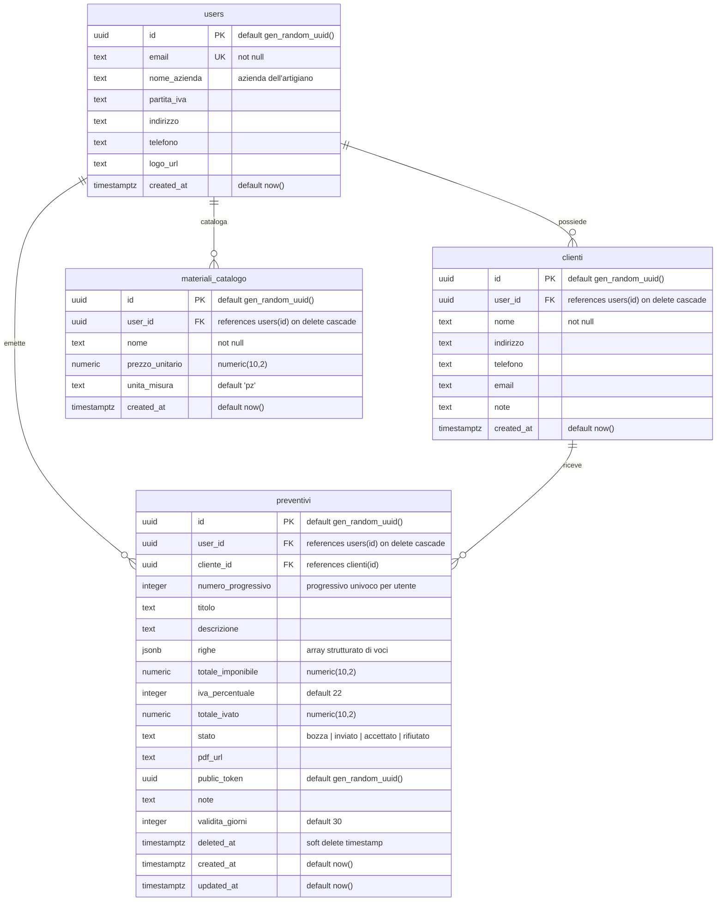
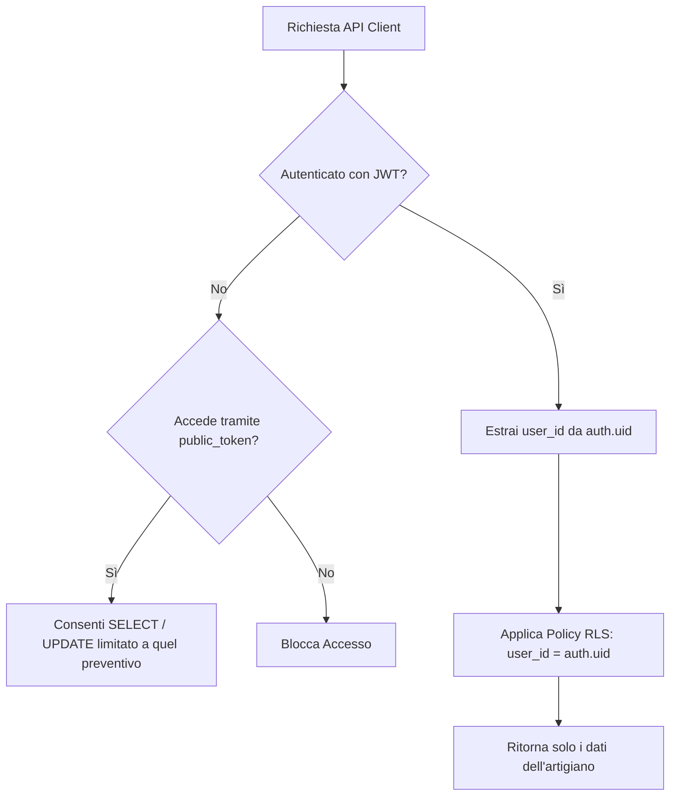

# 💾 Modello dei Dati e Database

Il database di ArtigianoAI è ospitato su Supabase ed è basato su **PostgreSQL**. È progettato per garantire prestazioni elevate, integrità referenziale assoluta e una rigorosa sicurezza multi-tenant tramite l'uso nativo delle **Row-Level Security (RLS) Policies** di PostgreSQL.

---

## 🗺️ Diagramma Entità-Relazione (ERD)

Il diagramma seguente mostra le relazioni tra le quattro tabelle principali del database. Il modello isola rigorosamente i dati di ciascun artigiano (`users`) assicurando che le anagrafiche dei clienti, i preventivi e il catalogo materiali rimangano rigorosamente privati e separati.



---

## 📖 Dizionario dei Dati

### 1. Tabella: `users`
Contiene il profilo dell'artigiano registrato (tenant principale).
*   *Nota: L'autenticazione è delegata a Supabase Auth. Il campo `users.id` corrisponde esattamente al `sub` del token JWT dell'utente autenticato.*

| Nome Colonna | Tipo SQL | Vincoli | Descrizione |
| :--- | :--- | :--- | :--- |
| `id` | `uuid` | `PRIMARY KEY`, `DEFAULT gen_random_uuid()` | Identificativo univoco dell'artigiano. |
| `email` | `text` | `UNIQUE`, `NOT NULL` | Indirizzo email di registrazione. |
| `nome_azienda`| `text` | - | Nome commerciale o ragione sociale. |
| `partita_iva` | `text` | - | Partita IVA italiana (11 cifre). |
| `indirizzo` | `text` | - | Indirizzo della sede legale/operativa. |
| `telefono` | `text` | - | Numero di contatto telefonico. |
| `logo_url` | `text` | - | Link all'immagine del logo (bucket storage). |
| `created_at` | `timestamptz`| `DEFAULT now()` | Timestamp di registrazione. |

### 2. Tabella: `clienti`
Anagrafica dei clienti di ciascun artigiano.

| Nome Colonna | Tipo SQL | Vincoli | Descrizione |
| :--- | :--- | :--- | :--- |
| `id` | `uuid` | `PRIMARY KEY`, `DEFAULT gen_random_uuid()` | Identificativo univoco del cliente. |
| `user_id` | `uuid` | `FOREIGN KEY REFERENCES users(id) ON DELETE CASCADE` | ID dell'artigiano proprietario. |
| `nome` | `text` | `NOT NULL` | Nome e Cognome o Ragione Sociale cliente. |
| `indirizzo` | `text` | - | Sede o indirizzo di residenza. |
| `telefono` | `text` | - | Recapito telefonico. |
| `email` | `text` | - | Email del cliente (per invio PDF). |
| `note` | `text` | - | Note aggiuntive interne. |
| `created_at` | `timestamptz`| `DEFAULT now()` | Data di inserimento in anagrafica. |

### 3. Tabella: `preventivi`
Il cuore operativo del sistema, contenente le righe di dettaglio e gli importi calcolati.

| Nome Colonna | Tipo SQL | Vincoli | Descrizione |
| :--- | :--- | :--- | :--- |
| `id` | `uuid` | `PRIMARY KEY`, `DEFAULT gen_random_uuid()` | Identificativo univoco del preventivo. |
| `user_id` | `uuid` | `FOREIGN KEY REFERENCES users(id) ON DELETE CASCADE` | ID dell'artigiano emittente. |
| `cliente_id` | `uuid` | `FOREIGN KEY REFERENCES clienti(id)` | ID del cliente di destinazione. |
| `numero_progressivo` | `integer`| `NOT NULL` | Numero progressivo automatico dell'artigiano. |
| `titolo` | `text` | - | Titolo del preventivo (es. "Rifacimento Bagno"). |
| `descrizione` | `text` | - | Descrizione estesa del preventivo. |
| `righe` | `jsonb` | `NOT NULL`, `DEFAULT '[]'` | Array JSON contenente le singole voci (vedi dettaglio). |
| `totale_imponibile` | `numeric(10,2)`| - | Somma imponibile delle righe del preventivo. |
| `iva_percentuale` | `integer`| `DEFAULT 22` | Aliquota IVA applicata (`4`, `10`, `22`). |
| `totale_ivato` | `numeric(10,2)`| - | Somma totale comprensiva di IVA. |
| `stato` | `text` | `DEFAULT 'bozza'` | Stato del preventivo (`bozza`, `inviato`, `accettato`, `rifiutato`). |
| `pdf_url` | `text` | - | Link al file PDF generato all'interno del Bucket Supabase. |
| `public_token` | `uuid` | `DEFAULT gen_random_uuid()` | Token cryptograficamente sicuro per accesso pubblico. |
| `note` | `text` | - | Note o condizioni di pagamento visibili al cliente. |
| `validita_giorni` | `integer`| `DEFAULT 30` | Giorni di validità legale del preventivo. |
| `deleted_at` | `timestamptz`| - | Data di eliminazione (Soft Delete). |
| `created_at` | `timestamptz`| `DEFAULT now()` | Data di creazione. |
| `updated_at` | `timestamptz`| `DEFAULT now()` | Data dell'ultima modifica (gestito via Trigger). |

### 4. Tabella: `materiali_catalogo`
Catalogo privato dei materiali e delle tariffe orarie dell'artigiano.

| Nome Colonna | Tipo SQL | Vincoli | Descrizione |
| :--- | :--- | :--- | :--- |
| `id` | `uuid` | `PRIMARY KEY`, `DEFAULT gen_random_uuid()` | Identificativo univoco del materiale. |
| `user_id` | `uuid` | `FOREIGN KEY REFERENCES users(id) ON DELETE CASCADE` | ID dell'artigiano proprietario. |
| `nome` | `text` | `NOT NULL` | Nome descrittivo del materiale o servizio. |
| `prezzo_unitario` | `numeric(10,2)`| - | Prezzo predefinito per unità. |
| `unita_misura` | `text` | `DEFAULT 'pz'` | Unità di misura (`pz`, `m`, `ora`, `kg`, `corpo`). |
| `created_at` | `timestamptz`| `DEFAULT now()` | Data di inserimento a catalogo. |

---

## 📦 Struttura JSONB del Campo `preventivi.righe`

Per garantire la massima flessibilità nel tempo senza dover ricorrere a migrazioni complesse di tabelle correlate, il campo `righe` è implementato come un array `jsonb` strutturato. Ogni riga deve rispettare scrupolosamente la seguente struttura TypeScript definita in `@artigianoai/shared`:

```json
[
  {
    "tipo": "manodopera",
    "descrizione": "Installazione e cablaggio quadro elettrico generale",
    "qty": 6.5,
    "prezzo_unitario": 35.00
  },
  {
    "tipo": "materiale",
    "descrizione": "Cavo unipolare FG16OR16 3G2.5 mmq (matassa 100m)",
    "qty": 2,
    "prezzo_unitario": 85.50
  }
]
```

### Regole di validazione (Zod):
*   `tipo`: Deve essere rigorosamente o `"manodopera"` o `"materiale"`.
*   `qty`: Numero positivo a virgola mobile (es. `1.5` ore o `12` pezzi).
*   `prezzo_unitario`: Numero maggiore o uguale a zero, arrotondato al centesimo.

---

## 🔒 Sicurezza: PostgreSQL Row-Level Security (RLS)

La sicurezza multi-tenant del sistema è implementata a livello di database per garantire che nessun artigiano possa mai accedere, anche accidentalmente, ai dati di un altro utente.



### Regole e Policy RLS nel Dettaglio

1.  **Isolamento dell'Artigiano**:
    *   Tutte le tabelle (`clienti`, `preventivi`, `materiali_catalogo`) hanno la sicurezza RLS attiva (`ALTER TABLE nome_tabella ENABLE ROW LEVEL SECURITY;`).
    *   Per ogni operazione (`SELECT`, `INSERT`, `UPDATE`, `DELETE`), la policy di base verifica che l'identificativo dell'utente corrisponda al `uid()` memorizzato nel token JWT di Supabase:
        ```sql
        CREATE POLICY "Gli utenti possono accedere solo ai propri record" 
          ON clienti 
          FOR ALL 
          USING (user_id = auth.uid());
        ```

2.  **Flusso di Approvazione Pubblica (Senza Autenticazione)**:
    Il cliente finale dell'artigiano deve poter visualizzare ed accettare il preventivo ricevendo un link privato senza dover creare un account o effettuare il login. Per consentire questo, la tabella `preventivi` implementa delle policy RLS specifiche basate sul campo `public_token`:
    *   **Policy di Lettura Pubblica**: Consente a chiunque in possesso del token pubblico univoco di visualizzare il preventivo:
        ```sql
        CREATE POLICY "Accesso pubblico in lettura tramite token" 
          ON preventivi 
          FOR SELECT 
          USING (public_token IS NOT NULL AND deleted_at IS NULL);
        ```
    *   **Policy di Aggiornamento Pubblico**: Consente al cliente di accettare o rifiutare il preventivo aggiornandone esclusivamente lo `stato`:
        ```sql
        CREATE POLICY "Aggiornamento pubblico dello stato tramite token" 
          ON preventivi 
          FOR UPDATE 
          USING (public_token IS NOT NULL AND deleted_at IS NULL)
          WITH CHECK (stato IN ('accettato', 'rifiutato'));
        ```

---

## ⚡ Indici di Database e Ottimizzazioni

Per assicurare risposte in millisecondi anche con centinaia di migliaia di record, sono configurati i seguenti indici all'interno del database:

*   **`preventivi_user_numero_progressivo_idx` (UNIQUE INDEX)**:
    Garantisce che la coppia `(user_id, numero_progressivo)` sia univoca e consente un recupero fulmineo dei preventivi in ordine sequenziale.
*   **`preventivi_public_token_idx` (B-Tree INDEX)**:
    Ottimizza la query di caricamento pubblico del preventivo `/p/:token` utilizzata dai clienti per l'approvazione.
*   **`clienti_user_id_idx` & `materiali_catalogo_user_id_idx` (B-Tree INDEX)**:
    Velocizzano drasticamente il caricamento delle tabelle di anagrafica e catalogo visualizzate nella dashboard dell'artigiano.
*   **`preventivi_deleted_at_idx` (B-Tree INDEX)**:
    Utilizzato per escludere rapidamente i preventivi eliminati logici (soft delete) durante le query di recupero quotidiane.
