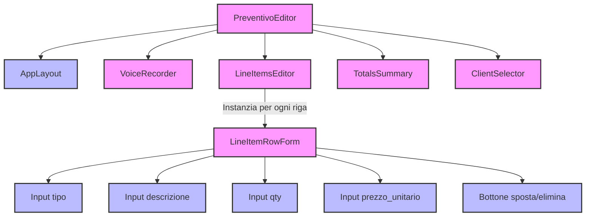
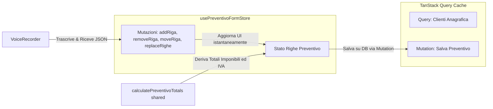
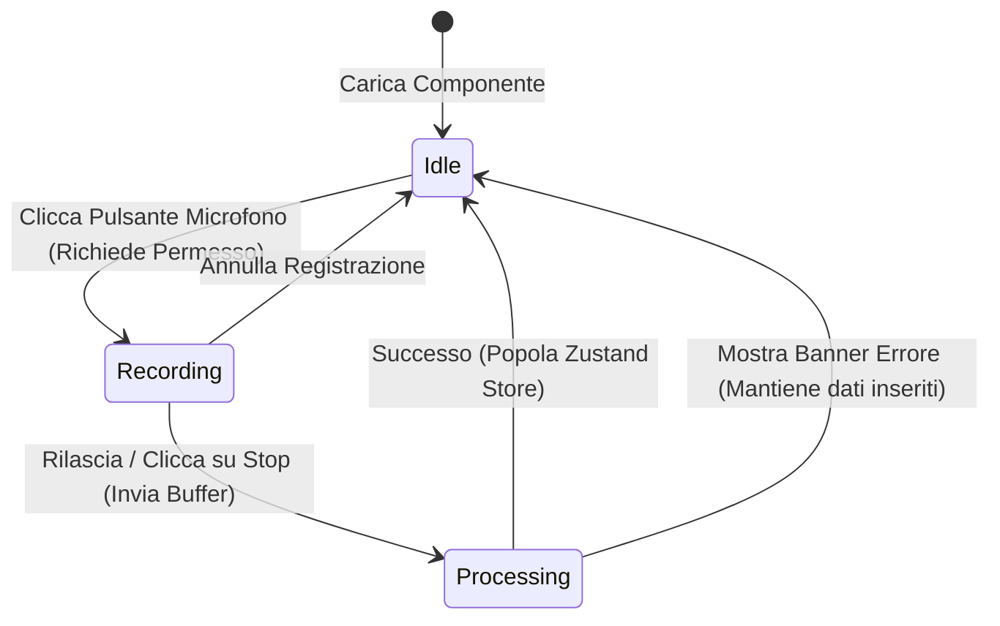

# 📱 Frontend e Design System

Il frontend di ArtigianoAI è un'applicazione web a pagina singola (SPA) ad alte prestazioni, interamente ottimizzata per dispositivi mobili ed incentrata sull'esperienza in mobilità dell'artigiano. Adotta un'estetica premium ad alto impatto emotivo basata su **React**, **Vite**, **TypeScript** e **Tailwind CSS**.

---

## 🗺️ Mappa delle Pagine e Controllo Accessi

L'applicazione garantisce una navigazione fluida e protegge rigorosamente le aree riservate tramite Route Guards client-side collegate a Supabase Auth.

| Path | Pagina Corrispondente | Livello di Accesso | Descrizione |
| :--- | :--- | :--- | :--- |
| `/login` | `LoginPage.tsx` | Pubblico | Autenticazione email e password dell'artigiano. |
| `/` | `DashboardPage.tsx` | Protetto (JWT) | Panoramica preventivi emessi, stato vendite e scorciatoie rapide. |
| `/preventivi/nuovo` | `PreventivoNewPage.tsx` | Protetto (JWT) | Inizializzatore del flusso di compilazione preventiva. |
| `/preventivi/:id` | `PreventivoEditPage.tsx` | Protetto (JWT) | Editor visivo avanzato delle righe e dei totali del preventivo. |
| `/clienti` | `ClientiPage.tsx` | Protetto (JWT) | Anagrafica e directory dei clienti. |
| `/clienti/:id` | `ClienteDetailPage.tsx`| Protetto (JWT) | Dettaglio cliente e storico cronologico dei preventivi associati. |
| `/p/:token` | `PublicPreventivoPage.tsx`| Pubblico | Landing page mobile di accettazione/firma per il cliente finale. |

---

## 🌳 Albero dei Componenti (Editor Preventivo)

La schermata principale di creazione preventivo (`/preventivi/nuovo` che istanzia `PreventivoEditor`) è strutturata come un albero di componenti focalizzati e riutilizzabili:

---

## 💾 Gestione dello Stato: Zustand e TanStack Query

Il frontend divide in modo pulito lo stato locale effimero dallo stato del server a lungo termine.

### Struttura dello Store `usePreventivoFormStore`
Lo store Zustand gestisce le mutazioni in tempo reale della griglia del preventivo:
*   `righe`: Array di righe preventivo arricchite temporaneamente da un ID lato client (`crypto.randomUUID()`) per consentire chiavi univoche sicure nel ciclo di rendering React (`key={riga.id}`).
*   `addRiga(tipo)`: Aggiunge una riga vuota impostata come `"manodopera"` o `"materiale"`.
*   `updateRiga(id, patch)`: Aggiorna parzialmente una singola riga (es. quando l'utente digita una nuova descrizione o modifica la quantità).
*   `moveRiga(id, 'up' | 'down')`: Modifica l'ordine visivo delle righe per consentire di raggruppare i materiali sotto la manodopera.
*   `getRigheForApi()`: Rimuove gli ID client temporanei e restituisce l'array pulito e pronto per essere convalidato da Fastify.

---

## 🎙️ Deep-Dive: Il Componente `VoiceRecorder`

Il componente `VoiceRecorder.tsx` racchiude la complessa logica di cattura audio tramite browser mobile o desktop.

### Macchina a Stati del Registratore Vocale
Il componente implementa una macchina a stati finiti per garantire una UX impeccabile ed evitare conflitti hardware del microfono:

### Gestione della Compatibilità Mobile (iOS Safari / Android Chrome)
La cattura audio in mobilità presenta forti discrepanze tra i sistemi operativi. `VoiceRecorder` risolve queste sfide tramite:
1.  **Scelta dinamica del formato Mime**:
    *   Su iOS (Safari), il formato predefinito supportato per la cattura vocale è `audio/mp4` o `audio/aac`.
    *   Su Android (Chrome), viene utilizzato `audio/webm;codecs=opus`.
    *   Il backend Fastify analizza dinamicamente il Content-Type per istruire Whisper in modo corretto.
2.  **Policy di attivazione microfono**:
    *   Il browser richiede l'interazione diretta dell'utente (*User Gesture*) prima di poter inizializzare la classe `AudioContext` nativa del dispositivo.
    *   I permessi revocati vengono gestiti mostrando graficamente una finestra modale d'aiuto per guidare l'utente all'attivazione del microfono nelle impostazioni di sistema del telefono.

---

## 🎨 Design System e Token Visivi

L'interfaccia adotta un'estetica premium denominata **Sleek Charcoal & Amber** per trasmettere autorevolezza, professionalità e massima visibilità sotto la luce diretta del sole nei cantieri.

### 1. Palette dei Colori (Tailwind CSS esteso)
*   **Background Principale**: `#0B0F19` (Charcoal scuro profondo per prevenire l'affaticamento degli occhi).
*   **Card e Moduli**: Glassmorphism con sfondo `#161D30` al 70% di opacità, contorni sfumati a `rgba(255,255,255,0.08)` ed effetto sfocatura (`backdrop-blur-md`).
*   **Colore Accento (Primario)**: Sfumatura da `#FBBF24` (Amber-400) a `#F59E0B` (Amber-500) per dare una sensazione di dinamicità ed energia (associato alla sicurezza in cantiere).
*   **Stati**:
    *   Bozza: `#64748B` (Slate)
    *   Inviato: `#3B82F6` (Blue)
    *   Accettato: `#10B981` (Emerald)
    *   Rifiutato: `#EF4444` (Red)

### 2. Tipografia e Micro-Animazioni
*   **Font di Testo**: *Inter* per la massima leggibilità dei numeri e delle tabelle dei prezzi.
*   **Font di Titolo**: *Outfit* per conferire un aspetto moderno, geometrico e audace all'applicazione.
*   **Transizioni**: Tutti gli elementi interattivi (pulsante microfono, righe dell'editor) hanno una transizione di stato fluida (`transition-all duration-300 ease-out`) con un leggero aumento di scala al tocco per fornire un feedback tattile premium.
