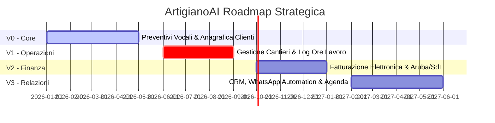
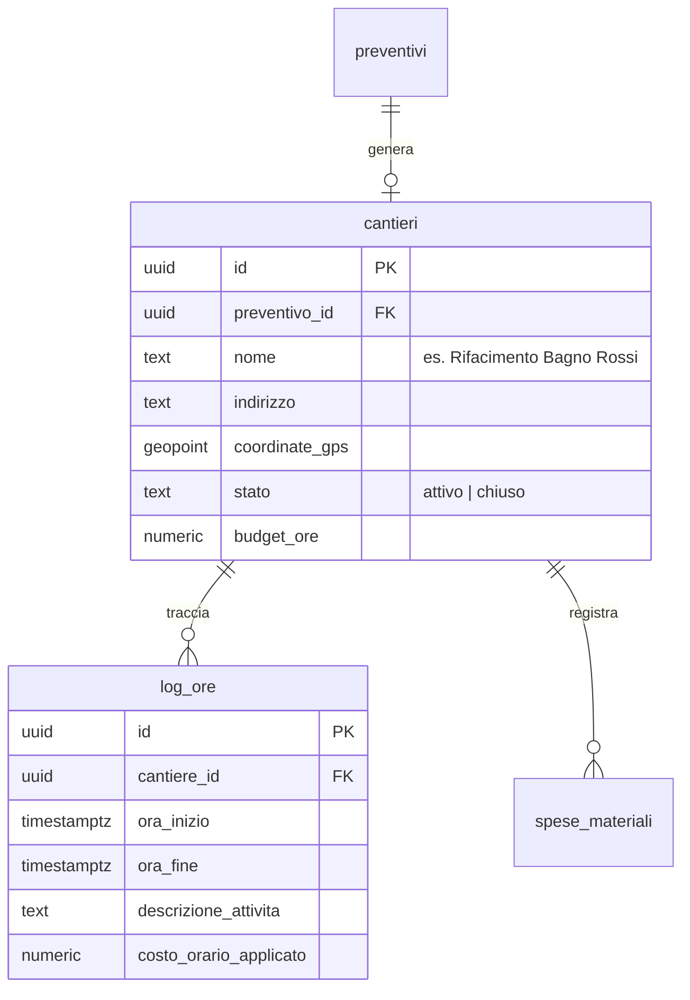
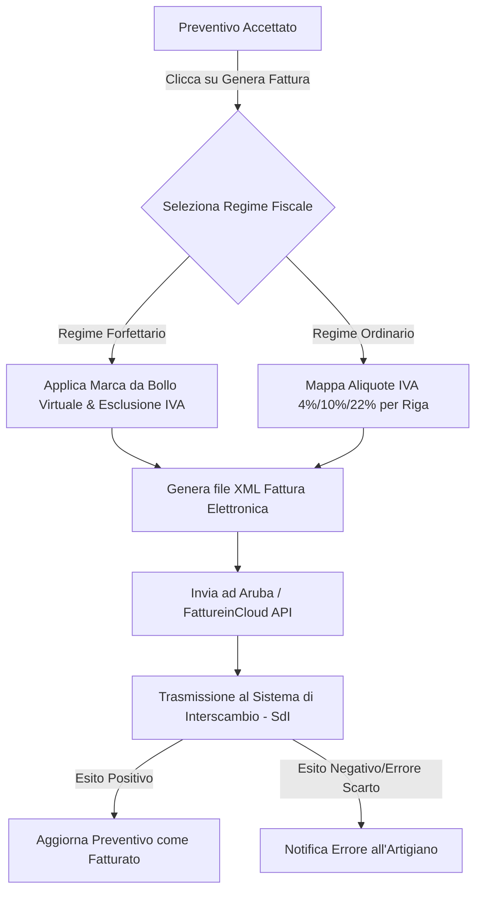

# 🗺️ Roadmap di Sviluppo (V0 -> V3)

ArtigianoAI segue una pianificazione incrementale finalizzata a trasformare un modulo di preventivazione vocale in un'applicazione di gestione operativa e finanziaria a 360 gradi per le ditte individuali e le piccole PMI in Italia.

---

## 📊 Matrice di Evoluzione del Prodotto

---

## 🛠️ Analisi Dettagliata dei Moduli Futuri

### Modulo V1: Gestione Cantieri e Monitoraggio Tempi (Cantiere & Ore)

*   **Il Problema**: Gli artigiani faticano a calcolare l'effettiva redditività di un cantiere. Spesso sforano le ore preventivate senza accorgersene, erodendo tutto il margine di guadagno.
*   **Soluzione Proposta**: Introdurre l'entità "Cantiere" (collegata a un Cliente e a uno o più Preventivi approvati) e un sistema integrato di timbratura virtuale (*Clock In / Clock Out*).

*   **Sfide Tecniche principali**:
    1.  **Geofencing GPS**: Acquisizione in background delle coordinate GPS dello smartphone per verificare che l'artigiano abbia avviato il timer mentre si trovava effettivamente presso il cantiere del cliente, evitando inserimenti errati.
    2.  **Gestione del Timer Offline**: Consentire l'avvio e l'arresto del timer di lavoro anche se lo smartphone perde la connessione all'interno dell'edificio, memorizzando i log localmente per poi sincronizzarli a fine giornata.

---

### Modulo V2: Fatturazione Elettronica Italiana (SdI & Aruba)

*   **Il Problema**: Una volta completato il lavoro, l'artigiano deve ricopiare manualmente tutti i dati del preventivo all'interno del proprio gestionale fiscale per emettere la fattura elettronica obbligatoria per legge in Italia.
*   **Soluzione Proposta**: Integrazione diretta tramite API con i principali provider di fatturazione elettronica (es. **Aruba Cloud API**, **FattureinCloud**) per convertire con un singolo clic un preventivo in stato `"accettato"` in una fattura XML pronta per essere trasmessa al **Sistema di Interscambio (SdI)** dell'Agenzia delle Entrate.

*   **Sfide Tecniche ed Estensioni del Database**:
    1.  **Estensione Dati Azienda (`users`)**: Richiede l'inserimento di campi obbligatori per la fatturazione elettronica: Regime Fiscale (es. `RF19` per forfettari), Codice Destinatario (SDI) del cliente, Pec ed indicazione della cassa previdenziale (es. INPS o cassa artigiani).
    2.  **Mappatura Fiscale del Catalogo**: Mappatura automatica dei materiali con i codici IVA specifici ed indicazione automatica delle ritenute d'acconto o delle esclusioni d'imposta per prestazioni eseguite in regime forfettario.

---

### Modulo V3: CRM Avanzato, Agenda e Automation (CRM)

*   **Il Problema**: Gli artigiani perdono molto tempo nella gestione dei contatti, nella pianificazione degli appuntamenti di sopralluogo e nell'invio dei solleciti per i preventivi inviati ma non ancora firmati.
*   **Soluzione Proposta**: Un'agenda intelligente integrata con WhatsApp Business API che automatizza le relazioni con il cliente.

*   **Funzionalità Chiave**:
    1.  **Sopralluoghi con Auto-Booking**: L'artigiano invia un link personalizzato al cliente, il quale può scegliere in autonomia lo slot orario per il sopralluogo in base alle reali disponibilità del calendario dell'artigiano (sincronizzato in tempo reale con Google Calendar o Outlook).
    2.  **Notifiche Automatiche WhatsApp**:
        *   Promemoria automatico al cliente 24 ore prima del sopralluogo programmato.
        *   Invio automatico del preventivo PDF via WhatsApp non appena completato.
        *   Sollecito amichevole di lettura dopo 4 giorni dall'invio del preventivo se lo stato è ancora `"inviato"`.
    3.  **Diario Storico del Cliente**: Cronistoria completa di tutte le interazioni avvenute con il cliente (appuntamenti effettuati, preventivi accettati/rifiutati, note scritte ed audio registrati nel corso degli anni).
